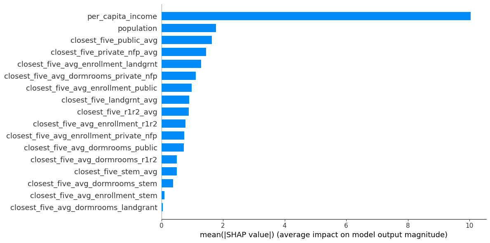
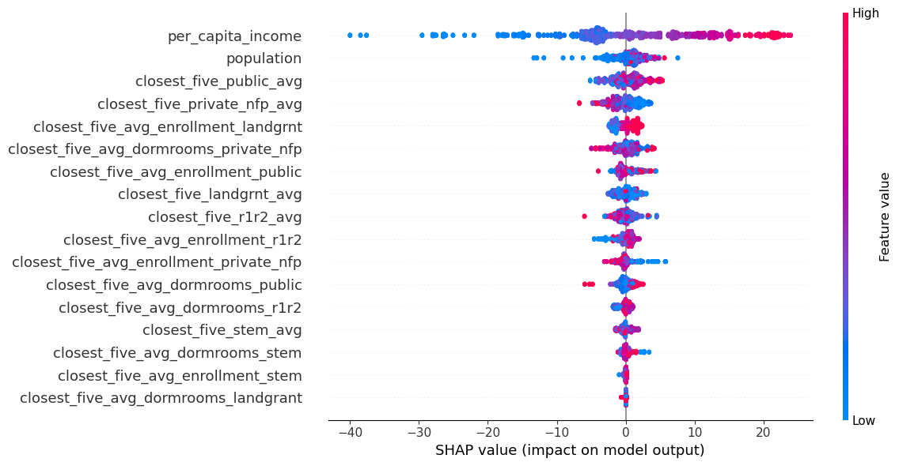

# AP Outcomes Data Processing and Modeling for Massachusetts

This repository contains the codes and resources used for machine learning models to analyze and predict Advanced Placement (AP) outcomes for Massachusetts. The datasets are located in the `../data/Massachusetts` directory within the main repository.

---

## Project Overview

This project aims to model and analyze AP outcomes in Massachusetts using various statistical and machine learning techniques. The primary target variable is the **AP pass rate**, defined as the percentage of exams scoring 3 or higher.

---

## File Descriptions

1. **`MA_model_selection.ipynb`**
   Evaluates various machine learning models to determine that `XGBoost` is the best model for the Massachusetts dataset.

2. **`MA_XGBoost_SHAP.ipynb`**
   Trains the Massachusetts AP dataset using `XGBoost`, analyzes feature importance, and explores feature correlations with AP outcomes using SHAP values.

3. **`MA_plotly.ipynb`**
   Uses `Plotly` for interactive visualizations showing the linear relationships between AP outcomes and the top five significant features.

---

## Features and Target Variables

### Target Variable
- **PERCENT_3_OR_ABOVE**: The percentage of AP exams scoring 3 or higher.

### Features
The model utilizes 17 features, categorized as follows:

1. **Demographic Features**:
   - **Population**
   - **Per capita income**

2. **University-Related Features** (for the five nearest universities per county, categorized by type):
   - Average distance
   - Annual enrollment
   - Number of dormitory beds

   University types:
   - R1/R2 universities
   - Public universities
   - Private not-for-profit universities
   - Land-grant universities
   - STEM universities

### Data Sources and Computations
- **County Locations**: Derived from [SimpleMaps US Counties dataset](https://simplemaps.com/data/us-counties) and saved in `../data/uscounties.csv`.
- **University Locations**: Acquired using Google Geocoders.
- **Distance Calculation**: Computed using the `geopy.distance` function.
- **Training Data**: Combines Massachusetts AP data from the 2019–2023 academic years.

---

## Statistical and Machine Learning Models

### Statistical Analysis (Using `statsmodels`)
- **Linear Regression Models**:
  - **Full Model**: Includes all 17 features.
  - **Non-University Model**: Includes only population and per capita income.
  - **University Model**: Includes only university-related variables.

- Significant p-values in the full model comparisons confirmed the importance of both university-related and non-university-related variables.

### Machine Learning Models (Using `sklearn` and `xgboost`)
We evaluated the following models using 5-fold cross-validation:

| Model                 | RMSE   | RMSE STD | R-squared |
|-----------------------|--------|----------|-----------|
| `Baseline`            | 17.390 | 0.473    | 0.000     |
| `Full Model`          | 12.496 | 0.265    | 0.483     |
| `Ridge Regression`    | 12.514 | 0.271    | 0.482     |
| `PCA` (0.95)          | 12.607 | 0.297    | 0.474     |
| `Adaboost`            | 10.710 | 0.030    | 0.620     |
| `Random Forest`       | 9.169  | 0.027    | 0.721     |
| `XGBoost`             | 9.078  | 0.040    | 0.725     |

- **Best Model**: `XGBoost` chosen for its performance on RMSE and R-squared.

---

## Top 5 Features Identified by SHAP

We use `XGBoost` for the Massachusetts AP performance analysis and made use of SHAP values for feature selection. 

First, we use the SHAP summary bar plot to show the average impact of each feature on the model’s predictions, as measured by their mean absolute SHAP values. We identify the top five features as
1. Per capita income
2. Population
3. Average distance to the five closest public universities
4. Average distance to the five closest private not-for-profit universities
5. Average annual enrollment for the five closest land-grant universities

Next, we present a density scatter plot of SHAP values to illustrate how each feature influences the model’s predictions for individual validation samples. In the plot, each point represents a sample: its position along the x-axis indicates the feature’s positive or negative impact on the model’s output, and its color reflects the feature value (red for high values, blue for low values). High-density areas highlight overlapping SHAP values, emphasizing the variability in feature impacts across samples.

---

## Conclusion
`XGBoost` emerged as the best-performing model for predicting AP outcomes in Massachusetts. The repository includes resources for model training, feature importance analysis, and interactive visualizations.

SHAP value analysis identified **per capita income** as the most influential factor, surpassing the combined impact of the next four features. Wealthier districts likely benefit from better funding, more AP offerings, superior resources, and additional academic support, which collectively enhance AP performance outcomes.