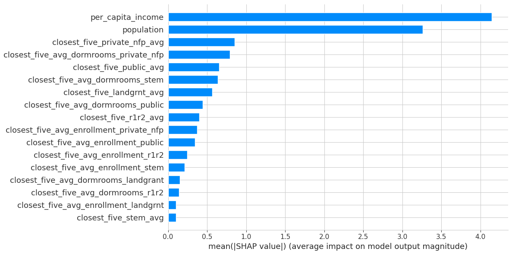
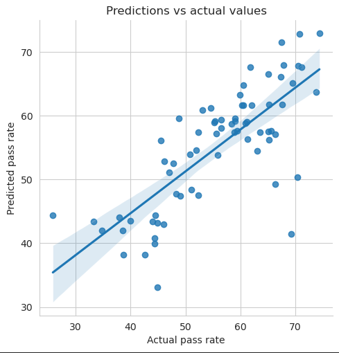

# AP Outcomes data processing and modelling for Wisconsin state
This folder contains our codes for machine learning models for Wisconsin state. The datasets are in ../data/Wisconsin folder of the main directory.

### Description of the files
1. In wisconsin_data_processing.py file, we gather the datasets for Wisconsin state, process them and create a new dataframe containing all the features and target variables necessary for modelling. The work was originally done in jupyter notebook working_with_wisconsin.ipynb, so that file contains essentially identical code, but in cell-by-cell format, that is easier to execute and read. The dataframe we obtain is then saved to a csv file called wisconsin_closest_five_method.csv, also found in ../data/Wisconsin folder. We also perform train-test-split on that dataframe; the training and testing data are saved as training.csv and testing.csv, respectively in ../data/Wisconsin folder.
2. In EDA_and_plots_with_plotly.ipynb, we collect some exploratory data analysis on the dataframe created in the previous file.
3. The wisconsin_models.ipynb file is where we create machine learning models.

### Description of features and target variables
- Our target variable is the AP pass rate, which is defined as the percentage of exams scoring 3 or higher. The corresponding columns are named 'PERCENT_3_OR_ABOVE'. There are altogether 17 features that we use. Two are population and per capita income. The other 15 are related to nearby universities. We look at universities in five categories: R1/R2 (defined as having very high or high research activity in Carnegie classification), public, private not for profit, landgrant and STEM (defined as having at least one doctoral/research degree offered in STEM field). For each category, we consider five closest universities to the given county (or rather, its rough geographical center) and compute average distance, annual enrollment (in academic year 2019/20) and number of dorm rooms to/at those universities.
- The distance is computed by using `distance` function in `geopy`. The county location is obtained from https://simplemaps.com/data/us-counties; the corresponding dataset is saved as ../data/uscounties.csv in the main directory. The locations for the universities are mostly acquired via Google geocoders.
- There are around 70 counties in Wisconsin, which is too small a number for machine learning modelling, so we combine data from the academic year 2018/19 to 2022/23 into one dataframe for creating models. The AP data, population and per capita income are vary across those five years, whereas the other 15 features do not. While we recognize that annual enrollment and number of dorm rooms could also change by year, our Carnegie dataset for universities only has data for one year, so we had to work with this limitations. Additionally, per capita income will only increase in time due to inflation, the average pass rate cannot increase indefinitely, if at all (there is an upper bound). So, we have a tradeoff to combining dataset for multiple years. Nonetheless, we decided to stick with the plan of combining five years data, so that our model will have enough to learn from.
- While we have more columns like total count of AP exams, total students count, etc. in our dataframe, we decided not to use them as features for two reasons: one, they are likely highly correlated with population, and two, not all states' datasets have all of those features.

### Description of the models
- We first did some statistical analysis with statsmodels. We created linear regression models one with all 17 features (called full model), another with only population and per capita income as features (called nonuni model) and another with only the 15 university related variables as features (called uni model). We then looked at the p-values of full model compared to both uni model and nonuni model. Both of the p-values were extremely small.
- Next, we used sklearn and xgboost to make several predictive regression models: OLS linear regression (called full model), Ridge regression model, Adaboost regressor model, Random Forest regressor model and xgboost model. The average root mean squared errors and R-squared coefficients across the 5-fold cross validation and comparison with the baseline ("take the average and call it a day" model) is summarized as follows:

| Model               | RMSE          | R-squared    |
| ------------------- | ------------- | ------------ |
| Baseline            | 13.895        | 0            |
| Full model          | 11.933        | 0.236        |
| Ridge model         | 11.897        | 0.242        |
| Adaboost model      | 10.214        | 0.444        |
| Random Forest model | 9.864         | 0.480        |
| Xgboost model       | 10.376        | 0.425        |

- Random Forest model performed the best, so we choose it to be our model for Wisconsin state to use on the testing data.
- The `SHAP` values for our Random Forest model is summarized in the following bar plot:

- As expected, per capita income is the most important feature in our model, but population is not far behind. The distances to private and public universities also carry some weight in our model. So, we conclude that while the university metrics are not as significant as the socio-economic factors on AP-performance, they still have some impact.

- The performance of our Random Forest model on the testing data is as follows:

| Model                | RMSE           | $R^2$         |
| -------------------- | -------------- | ------------- |
| Random Forest model  | 7.038          | 0.422         |

- The testing data predictions vs actual values scatter plot is given as follows:

